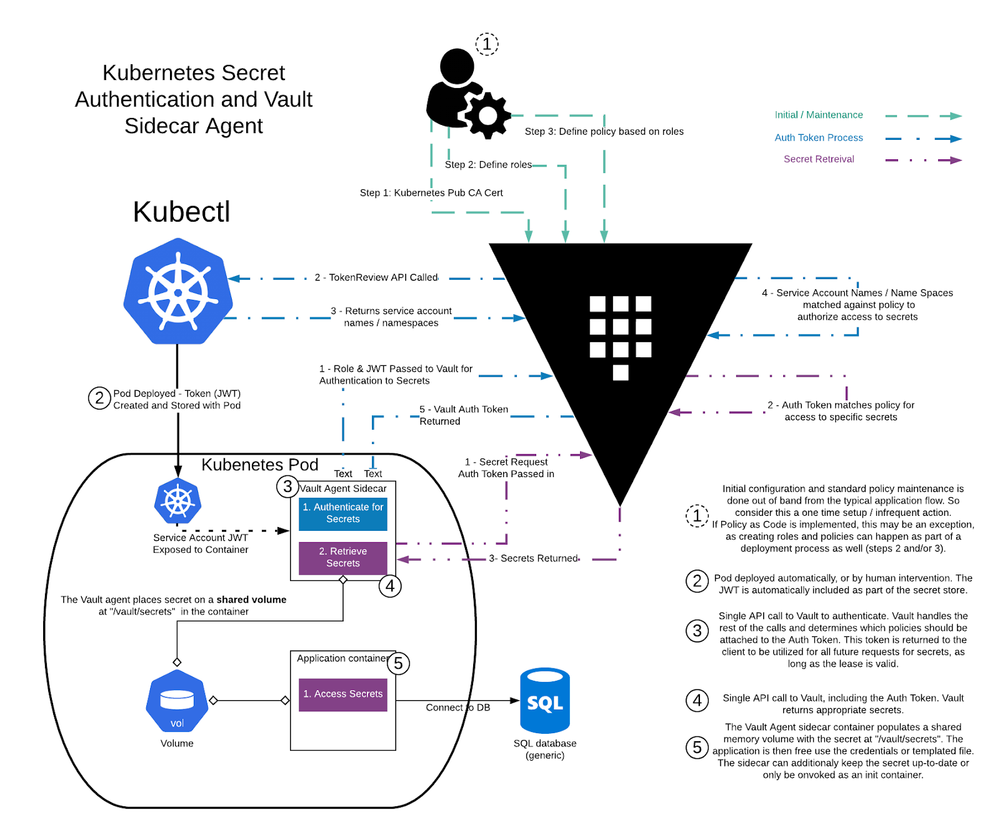

# Vault Injector: Demo

This repository has been created to help with demonstrating opportunities of Vault Injector in the Kubernetes cluster.


## Diagram




## Requirements

* Linux / MacOS
* [Vault](https://www.vaultproject.io/downloads)
* [Terraform](https://www.terraform.io/downloads.html)
* [Kubectl](https://kubernetes.io/docs/tasks/tools/#kubectl)
* [Minikube](https://minikube.sigs.k8s.io/docs/start/)
* [make](https://man7.org/linux/man-pages/man1/make.1.html)


## Walkthrough

Initialy, we should run the environment to deploy Vault Injector.

```sh
terraform -chdir="./vault" init
terraform -chdir="./injector" init

nohup vault server \
  -dev \
  -dev-root-token-id="root" \
  -dev-listen-address="0.0.0.0:8200" &
  
minikube start \
  --nodes 1 \
  --cpus 4 \
  --memory 8192 \
  --driver virtualbox \
  --apiserver-port 8443 \
  --kubernetes-version 1.19.12 \
  --profile vault
```

Now we have running Kubernetes cluster (minikube) and Vault. We need the following stuff in Vault:
 * Vault policies:
   * `backend` - create/update auth backend
   * `secret` - allow access to secrets
 * Vault AppRole with attached `backend` policy


## Links

* Agent Sidecar Injector - [https://www.vaultproject.io/docs/platform/k8s/injector]()
* HashiCorp Vault: Delivering Secrets with Kubernetes - [https://medium.com/hashicorp-engineering/hashicorp-vault-delivering-secrets-with-kubernetes-1b358c03b2a3]()
* Injecting Vault Secrets Into Kubernetes Pods via a Sidecar - [https://www.hashicorp.com/blog/injecting-vault-secrets-into-kubernetes-pods-via-a-sidecar]()
